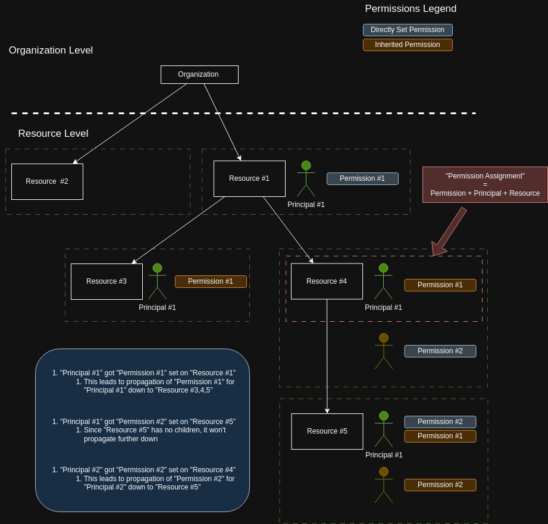

# Portarius - Documentation

## Secure the Gate with Portarius: Why the Name?

"Portarius," derived from the Latin word for "gatekeeper," reflects the platform's core purpose: providing secure and efficient **IAM (Identity and Access Management) as a Service** for your critical systems. As a digital gatekeeper, Portarius enforces fine-grained, hierarchical permissions for identities and resources, ensuring only authorized access through a streamlined, API-first approach.

Portarius delivers deeply customizable resource-based access control with hierarchical structures.

## Table of Contents

- [1. Introduction](#1-introduction)
- [2. Quick Start](#2-quick-start)
- [3. Concepts & Terminology](#3-concepts--terminology)
- [4. API Reference](#4-api-reference)
- [5. Troubleshooting](#5-troubleshooting)
- [6. Pricing](#6-pricing)
- [7. FAQs](#7-faqs)
- [8. Feedback](#8-feedback)

---

## 1. Introduction

### Overview of the product

Portarius is an **API-first identity and access management (IAM) platform** built for **service-to-service** integration. It provides a straightforward way to implement **scalable, hierarchical permission management** within your software, ensuring you can manage complex access needs efficiently.

With Portarius, you can:

- Establish **hierarchical relationships** between resources (e.g., Parent → Child → Grandchild).
- Enforce **granular permission control** for both users and services.
- Benefit from **automated permission propagation**, so that changes at higher levels cascade down.
- Use **custom IDs**, allowing you to maintain consistency with your existing user and resource identifiers.

### Key features

- **API-First Approach**
  Designed to integrate seamlessly with your applications using RESTful APIs.
- **Hierarchical Access Control**
  Define and manage parent-child relationships in your resource model.
- **Granular Permission Management**
  Assign highly specific access rights to users, services, or other principals.
- **Automatic Permission Inheritance**
  Permissions granted at the parent level propagate to all child resources.
- **Custom Identifiers**
  Bring your own IDs to query resources and users without mapping or duplicating data.

### Why use this service?

Portarius is especially useful for SaaS providers and enterprise platforms that require:

1. **Scalable, hierarchical, fine-grained access control**
   Tackle complex permission models that evolve with your product.
2. **A simplified approach to enforcing access policies**
   Avoid the overhead of building and maintaining your own IAM system.
3. **A developer-friendly, API-first solution**
   Integrate quickly into existing workflows and tech stacks.

---

## 2. Quick Start

### How to sign up and get started

1. **Request access** via email to create your organization.
2. Receive your **initial API key** for authenticating with Portarius.
3. Use the **REST API** to integrate Portarius into your application and start assigning permissions.

---

## 3. Concepts & Terminology

### API Keys

- **API Keys**
  - Associated with a single Organization.
  - Allow management of resources within that Organization.
  - Cannot be used to access resources in other organizations.
- **API Key Rotation**
  - Keys must be rotated manually by requesting a new key via email.
  - Multiple keys can be active at once to facilitate seamless rotation.
- **Expiration**
  - API keys do not expire automatically; rotation is manual for now.

### Organization, Principals, Resources, Permissions, Permission Assignments

These are the primary entities in Portarius:

- **Organizations**
  The top-level entity under which all other entities are managed.
- **Principals**
  Represent users, services, or other identities that request access.
- **Resources**
  Objects in the system (e.g., projects, tickets, files) to which access is controlled.
- **Permissions**
  Specify the types of actions principals can perform on resources.
- **Permission Assignment**
  Defines who (the Principal) can do what (the Permission) on which entity (the Resource).

#### Inheritance Logic



When a principal has permissions on a parent resource, those permissions propagate down the hierarchy.

### External IDs (`external_id`) & Portarius IDs

The **External ID** (`external_id`) is a unique identifier used within your own systems. Portarius allows you to continue using these IDs so you don’t have to rely on Portarius-generated identifiers. This simplifies integration, as you avoid maintaining separate mappings.

#### Key Benefits

- **Bring Your Own IDs**
  Keep using the identifiers you already have in your own systems.
- **Easier Integration**
  No need to convert or store system-generated Portarius IDs.
- **Improved Maintainability**
  Reduce overhead by working with familiar IDs throughout your processes.

#### Terminology

- **Identifier**
  A general term for any unique key referencing an entity in Portarius. This may be:
  - An **External Identifier** (`external_id`), defined and managed by you.
  - A **Portarius Identifier**, generated internally by Portarius.
    - In certain contexts (e.g., Permission entities), only a Portarius-generated ID is available.

---

## 4. API Reference

### REST API

You can find the REST API documentation in our OpenAPI specification [here](https://api.portarius.io/swagger/index.html?url=/swagger/spec.json).

#### Typical Flow

Below is an example workflow for creating entities, assigning permissions, and checking permissions.

```sh
###################################
## Set up variables for requests ##
###################################
export AUTH_HEADER="x-api-key: <YOUR_API_KEY>"
export ORG_ID="<YOUR_ORGANIZATION_ID>"
export BASE_URL="https://api.portarius.io"

##################################
## Initial Creation of Entities ##
##################################

# Create a Principal
curl -X POST $BASE_URL/principals \
  -H "Content-Type: application/json" \
  -H "$AUTH_HEADER" \
  -d '{
    "organization_id": "'$ORG_ID'",
    "external_id": "<my_external_principal_id>"
  }'
# Output:
# {
#   "id": "<portarius_principal_id>"
# }

# Create a Parent Resource
curl -X POST $BASE_URL/resources \
  -H "Content-Type: application/json" \
  -H "$AUTH_HEADER" \
  -d '{
    "organization_id": "'$ORG_ID'",
    "external_id": "<my_external_parent_resource_id>",
    "name": "<my_resource_name>"
  }'
# Output:
# {
#   "id": "<portarius_parent_resource_id>"
# }

# Create a Child Resource using Portarius IDs
curl -X POST $BASE_URL/resources \
  -H "Content-Type: application/json" \
  -H "$AUTH_HEADER" \
  -d '{
    "organization_id": "'$ORG_ID'",
    "external_id": "<my_external_child_resource_id>",
    "name": "<my_resource_name>",
    "parent_id_type": "id"
    "parent_id_value": "<portarius_parent_resource_id>"
  }'

# -- OR --

# Create a Child Resource using external IDs
curl -X POST $BASE_URL/resources \
  -H "Content-Type: application/json" \
  -H "$AUTH_HEADER" \
  -d '{
    "organization_id": "'$ORG_ID'",
    "external_id": "<my_external_child_resource_id>",
    "name": "<my_resource_name>",
    "parent_id_type": "external_id"
    "parent_id_value": "<my_external_parent_resource_id>"
  }'

# Output:
# {
#   "id": "<portarius_child_resource_id>"
# }

# Create a Permission
curl -X POST $BASE_URL/permissions \
  -H "Content-Type: application/json" \
  -H "$AUTH_HEADER" \
  -d '{
    "organization_id": "'$ORG_ID'",
    "name": "<my_permission_name>",
    "description": "<my_permission_description>"
  }'
# Output:
# {
#   "id": "<portarius_permission_id>"
# }

###########################
## Permission Assignment ##
###########################

# Assign a Permission using Portarius IDs
curl -X POST $BASE_URL/permission-assignments \
  -H "Content-Type: application/json" \
  -H "$AUTH_HEADER" \
  -d '{
    "organization_id": "'$ORG_ID'",
    "principal_id_type": "id",
    "principal_id_value": "<portarius_principal_id>",
    "resource_id_type": "id",
    "resource_id_value": "<portarius_resource_id>",
    "permission_id": "<portarius_permission_id>"
  }'

# -- OR --

# Assign a Permission using external IDs
curl -X POST $BASE_URL/permission-assignments \
  -H "Content-Type: application/json" \
  -H "$AUTH_HEADER" \
  -d '{
    "organization_id": "'$ORG_ID'",
    "principal_id_type": "external_id",
    "principal_id_value": "<my_external_principal_id>",
    "resource_id_type": "external_id",
    "resource_id_value": "<my_external_resource_id>",
    "permission_id": "<portarius_permission_id>"
  }'
# Output:
# {
#   "id": "<portarius_permission_assignment_id>"
# }

######################
## Permission Check ##
######################

# Check if a Principal has a specific Permission on a Child Resource (Portarius IDs)
curl -X GET "$BASE_URL/check?organization_id=$ORG_ID&principal_id_type=id&principal_id_value=<portarius_principal_id>&permission_id=<portarius_permission_id>&resource_id_type=id&resource_id_value=<portarius_child_resource_id>" \
  -H "Content-Type: application/json" \
  -H "$AUTH_HEADER"

# -- OR --

# Check if a Principal has a specific Permission on a Child Resource (External IDs)
curl -X GET "$BASE_URL/check?organization_id=$ORG_ID&principal_id_type=external_id&principal_id_value=<my_external_principal_id>&permission_id=<portarius_permission_id>&resource_id_type=external_id&resource_id_value=<my_external_child_resource_id>" \
  -H "Content-Type: application/json" \
  -H "$AUTH_HEADER"

# Output:
# {
#   "data": {
#     "is_allowed": true
#   }
# }

```

### Usage Metrics

Currently, usage metrics are provided upon request via email. An API endpoint for usage data is planned for future updates.

---

## 5. Troubleshooting

**Coming soon.**
For immediate support, please contact us via email.

---

## 6. Pricing

Portarius offers flexible pricing to suit both pay-as-you-go and committed usage. Choose from a free tier, pay-as-you-go, or a commitment-based plan for volume discounts.

### Pricing Overview

- **Free Tier**
  1,000 read and 250 write requests per day, plus 100 stored entities at no charge.
- **Commitment Plans**
  Monthly or annual commitments at discounted rates.
- **Pay-as-you-go**
  Charges apply for usage exceeding the free tier or your committed amount.

### Request Prices

| Request Type      | Price (€) |       per        |
| ----------------- | :-------: | :--------------: |
| **Read Request**  |   1.00    | 100,000 requests |
| **Write Request** |   1.50    | 100,000 requests |
| **Storage**       |   0.50    |  1,000 entities  |

- **Read Request**: Any GET request to the API.
- **Write Request**: Any POST, PUT, PATCH, or DELETE request to the API.
- **Entity**: A resource, permission, principal, or permission assignment.

### Commitment Plan

Contact us for more details and to discuss your specific usage needs.

---

## 7. FAQs

<details>
  <summary>Do you provide a UI for visualization/management?</summary>
  Not yet, but it's planned for the future.
</details>

<details>
  <summary>How do I rotate an API key?</summary>
  Request a new key via email, then update your integration with the new key. Both keys can be active at once to facilitate seamless rotation.
</details>

---

## 8. Feedback

For bug reports, feature requests, or support inquiries, please send an email to our team.
We value your feedback and strive to continually improve Portarius.
